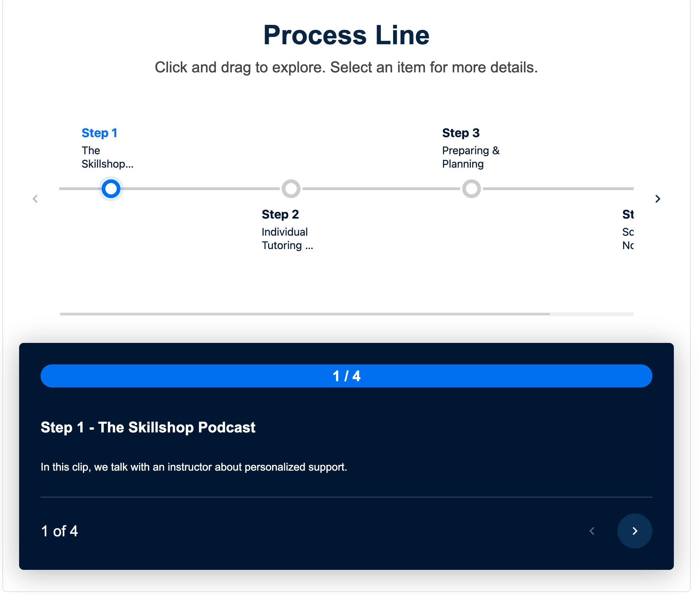

Process Line XBlock
###################

``xblock-processline`` is an Open edX XBlock for presenting a sequence of steps on a
horizontal process line. Learners can browse the timeline in the student view, and
course authors can configure content, styling, and item placement in Studio.

Current state
*************

The repository currently contains:

- the Python XBlock implementation in ``processline/``
- the frontend source for Studio and learner experiences in ``frontend/``
- committed built frontend assets in ``processline/public/``
- Python tests in ``tests/`` and frontend tests alongside the frontend source
- CI for Python and frontend validation in ``.github/workflows/``

Features
********

- configurable display name and introduction text
- configurable line items with title, label, description, position, and label placement
- configurable visual styling for both the line items and detail cards
- Studio preview that reuses the student component for placement review
- learner timeline navigation with clickable markers and detail navigation

Installation
************

Install directly from Git:

.. code-block:: bash

    pip install xblock-processline@git+https://github.com/open-craft/xblock-processline.git

If you are using Tutor, add the same requirement to
``OPENEDX_EXTRA_PIP_REQUIREMENTS``.

Using the XBlock in Open edX
***************************

To enable the XBlock in a course:

#. Add ``processline`` to the course **Advanced Module List**.
#. In Studio, add **Process Line** from the **Advanced** component list.
#. Configure the block in Studio and publish your changes.

Local development
*****************

Prerequisites
=============

- Python 3.11+
- Node.js ``v18.20.3`` for the frontend (see ``frontend/.nvmrc``)
- npm

Set up Python dependencies
==========================

The repository uses pinned requirements files.

.. code-block:: bash

    python -m venv .venv
    source .venv/bin/activate
    make requirements

This installs the development environment from ``requirements/dev.txt``.
It also provides ``pydantic2ts``, which the frontend build uses to generate
TypeScript types from the backend Pydantic models.

Set up frontend dependencies
============================

.. code-block:: bash

    cd frontend
    npm ci

For the fastest UI development loop after installing dependencies:

.. code-block:: bash

    cd frontend
    npm run dev

Frontend-only development
=========================

For faster UI iteration, run the frontend independently:

Make sure your Python development environment is active first, because
``npm run dev`` generates TypeScript types from ``processline/types.py`` before
starting Vite.

.. code-block:: bash

    cd frontend
    npm run dev

This starts the Vite development server for the Studio and student UI previews.

Testing and validation
**********************

Python
======

Run the Python test suite:

.. code-block:: bash

    pytest

Run the supported tox environments:

.. code-block:: bash

    tox -e py311-django42
    tox -e py312-django42
    tox -e quality

The ``quality`` environment currently runs:

- ``pycodestyle``
- ``pydocstyle``
- ``isort --check-only``
- ``ruff check .``
- ``make selfcheck``

Frontend
========

Run the frontend checks from ``frontend/``:

.. code-block:: bash

    npm run lint
    npm run test
    npm run coverage
    npm run build
    npm run check-build

``npm run check-build`` regenerates frontend types, rebuilds the frontend bundles,
and fails if generated files in ``frontend/src/types.ts`` or
``processline/public/`` are out of date.

Built assets
************

Frontend source lives in ``frontend/src/``. The backend schema in
``processline/types.py`` generates ``frontend/src/types.ts``, and the XBlock serves
built assets from ``processline/public/``. If you change frontend code or the backend
Pydantic models, rebuild before opening a PR:

.. code-block:: bash

    cd frontend
    npm run build

Commit both the source change and the regenerated assets.

Translations
************

The project still includes translation tooling. Useful commands:

.. code-block:: bash

    make extract_translations
    make compile_translations
    make validate_translations

Dependency maintenance
**********************

Pinned requirements are generated from the ``requirements/*.in`` files.
To refresh them:

.. code-block:: bash

    make upgrade

Contributing
************

When contributing:

#. Create a branch for your change.
#. Keep Python, frontend source, and generated frontend assets in sync.
#. Run the relevant checks before submitting a PR.
#. Update tests when behavior changes.
#. Keep the README accurate when contributor workflows change.

A typical contribution flow looks like this:

.. code-block:: bash

    make requirements
    cd frontend && npm ci
    pytest
    tox -e quality
    cd frontend && npm run lint && npm run test && npm run check-build
